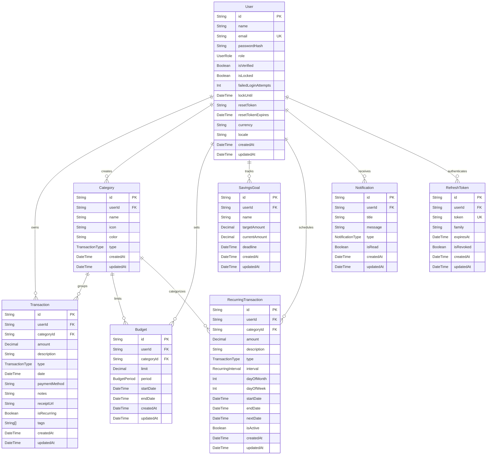

# C. ERD / Database Schema

## Entity-Relationship Diagram



## Enums

```mermaid
erDiagram
    UserRole {
        USER ADMIN
    }
    TransactionType {
        INCOME EXPENSE TRANSFER
    }
    BudgetPeriod {
        WEEKLY MONTHLY YEARLY
    }
    RecurringInterval {
        DAILY WEEKLY MONTHLY YEARLY
    }
    NotificationType {
        INFO WARNING ERROR SUCCESS
    }
```

## Relationship Cardinalities

| From | To | Type | On Delete | Notes |
|------|----|------|-----------|-------|
| User | Transaction | 1:N | Cascade | All transactions deleted when user deleted |
| User | Category | 1:N | Cascade | All categories deleted when user deleted |
| User | Budget | 1:N | Cascade | All budgets deleted when user deleted |
| User | SavingsGoal | 1:N | Cascade | All goals deleted when user deleted |
| User | RecurringTransaction | 1:N | Cascade | All recurring templates deleted when user deleted |
| User | Notification | 1:N | Cascade | All notifications deleted when user deleted |
| User | RefreshToken | 1:N | Cascade | All tokens deleted when user deleted |
| Category | Transaction | 1:N | **Set Null** | Transactions keep their data but lose category link |
| Category | Budget | 1:N | **Restrict** | Cannot delete category while budgets reference it (app reassigns first) |
| Category | RecurringTransaction | 1:N | **Restrict** | Cannot delete category while recurring templates reference it |

## Indexes

| Table | Columns | Type | Purpose |
|-------|---------|------|---------|
| Transaction | `[userId, date]` | Composite | Dashboard recent transactions, date-range filters |
| Transaction | `[userId, type]` | Composite | Filter by income/expense/transfer |
| Transaction | `[userId, categoryId]` | Composite | Category-based queries, budget spending |
| Transaction | `[userId, date, type]` | Composite | Monthly spending analytics |
| Category | `[userId]` | Single | User category lookup |
| Category | `[userId, name, type]` | **Unique** | Prevent duplicate category names per type per user |
| Budget | `[userId]` | Single | User budget list |
| Budget | `[categoryId]` | Single | Budget category lookup |
| Budget | `[userId, categoryId, period]` | **Unique** | One budget per category per period per user |
| SavingsGoal | `[userId]` | Single | User goals list |
| RecurringTransaction | `[userId]` | Single | User recurring list |
| RecurringTransaction | `[nextDate]` | Single | Cron job finds due transactions |
| Notification | `[userId]` | Single | User notifications |
| Notification | `[isRead]` | Single | Unread count queries |
| RefreshToken | `[userId]` | Single | Token cleanup |
| RefreshToken | `[token]` | **Unique** | Token lookup for refresh |

## Data Storage Notes

- All monetary amounts stored as `Decimal(12, 2)` in **USD** (base currency)
- Currency conversion happens at display time via `useFormatters` hook using Frankfurter API rates
- Passwords stored as bcrypt hashes (cost factor 12)
- Password reset tokens stored as SHA-256 hashes
- Receipt files stored in Vercel Blob at path `receipts/{userId}/{timestamp}-{sanitizedFilename}`
- Refresh tokens use family-based rotation for theft detection