# B. Wireframes / Mockups

> Preliminary screen designs for Coin Toss. All pages use shadcn/ui components with a warm brown (`#704c35`) color scheme and support light/dark mode.

Actual screenshots are in [`screenshots/`](screenshots/) (desktop at 1440×900, mobile at 390×844, both at 2× DPI).

---

## Layout Shell

### Desktop (≥768px)

```
┌──────────────────────────────────────────────────────────────────┐
│ ┌──────────┐  ┌──────────────────────────────────────────────┐  │
│ │          │  │  Page Title                                  │  │
│ │  COIN    │  └──────────────────────────────────────────────┘  │
│ │  TOSS    │  ┌──────────────────────────────────────────────┐  │
│ │          │  │                                              │  │
│ │ Dashboard│  │                                              │  │
│ │ Transact.│  │              Page Content                    │  │
│ │ Budgets  │  │                                              │  │
│ │ Goals    │  │                                              │  │
│ │ Analytics│  │                                              │  │
│ │ Notifs   │  │                                              │  │
│ │ Settings │  │                                              │  │
│ │          │  │                                              │  │
│ │ ──────── │  └──────────────────────────────────────────────┘  │
│ │ ♦ Jane   │                                                  │
│ │  j@e.co  │                                                  │
│ │ 🌑 Logout│                                                  │
│ └──────────┘                                                  │
└──────────────────────────────────────────────────────────────────┘
     256px                Remaining width
```

### Mobile (<768px)

```
┌──────────────────────┐
│  Coin Toss      🌑   │  ← Sticky top bar
├──────────────────────┤
│                      │
│   Page Content       │
│                      │
│   (Full width,       │
│    card-based)       │
│                      │
├──────────────────────┤
│ 🏠  💱  🐷  🎯  ⚙️  │  ← Bottom nav (5 items)
└──────────────────────┘
```

---

## 1. Login Page (`/login`)

**Desktop:**  | **Mobile:** 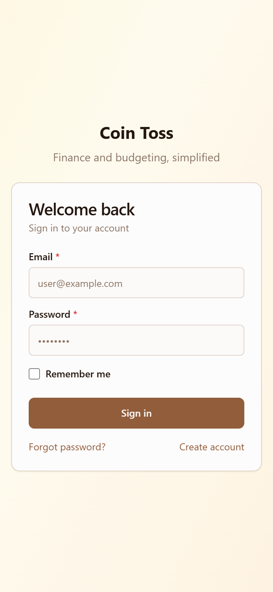

```
┌──────────────────────────────────────┐
│            background gradient        │
│                                      │
│        ┌──────────────────┐           │
│        │                  │           │
│        │    🪙 Coin Toss  │           │
│        │                  │           │
│        │  ┌────────────┐  │           │
│        │  │   Email    │  │           │
│        │  └────────────┘  │           │
│        │  ┌────────────┐  │           │
│        │  │  Password   │  │           │
│        │  └────────────┘  │           │
│        │  ☐ Remember me  │           │
│        │                  │           │
│        │  [  Sign In    ] │           │
│        │                  │           │
│        │  Forgot password?│           │
│        │  Create account  │           │
│        └──────────────────┘           │
│                                      │
└──────────────────────────────────────┘
```

- Centered card on gradient background
- AuthLayout wrapper (shared with /register, /forgot-password, /reset-password)
- Errors display below the submit button
- "Remember me" checkbox persists refresh token for 30 days
- Links to /forgot-password and /register

---

## 2. Register Page (`/register`)

**Desktop:** 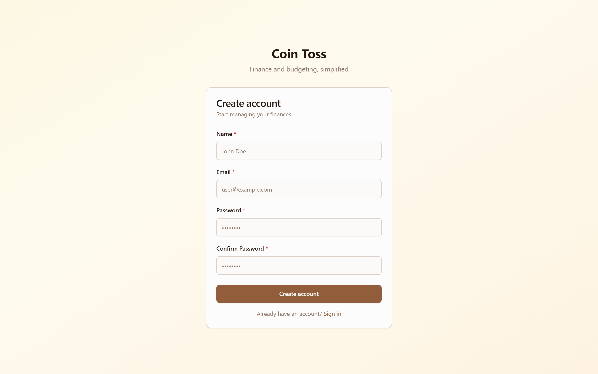 | **Mobile:** 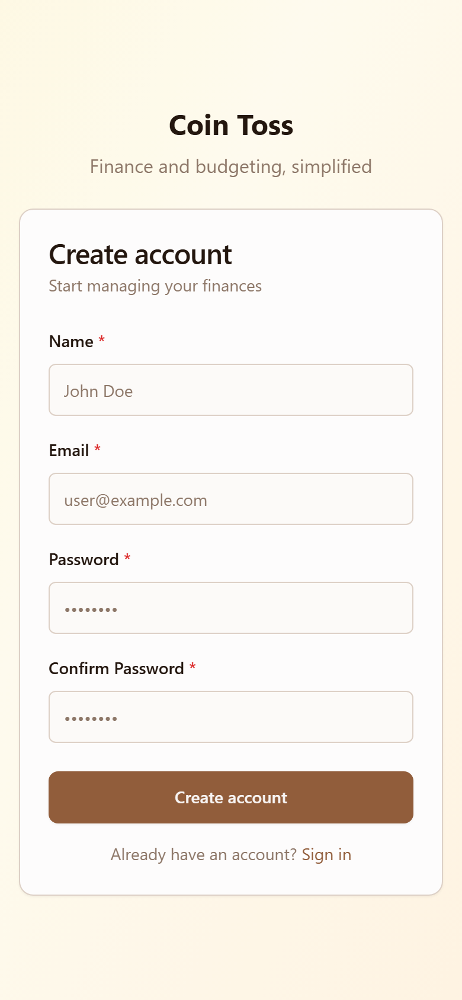

```
┌──────────────────────────────────────┐
│        ┌──────────────────┐          │
│        │    🪙 Coin Toss  │          │
│        │                  │          │
│        │  ┌────────────┐  │          │
│        │  │    Name *  │  │          │
│        │  └────────────┘  │          │
│        │  ┌────────────┐  │          │
│        │  │   Email *   │  │          │
│        │  └────────────┘  │          │
│        │  ┌────────────┐  │          │
│        │  │ Password *  │  │          │
│        │  └────────────┘  │          │
│        │  ┌────────────┐  │          │
│        │  │ Confirm *   │  │          │
│        │  └────────────┘  │          │
│        │                  │          │
│        │  [  Create     ] │          │
│        │                  │          │
│        │  Already have?   │          │
│        │  Sign in         │          │
│        └──────────────────┘          │
└──────────────────────────────────────┘
```

- Zod-validated: min 2 chars name, valid email, password ≥8 chars with uppercase + lowercase + number
- Red `*` indicator on required fields
- Links to /login

---

## 3. Forgot Password Page (`/forgot-password`)

**Desktop:** 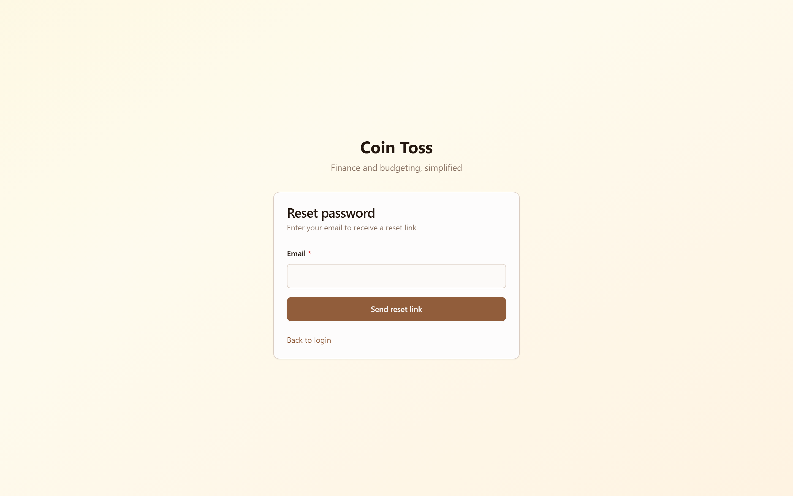 | **Mobile:** 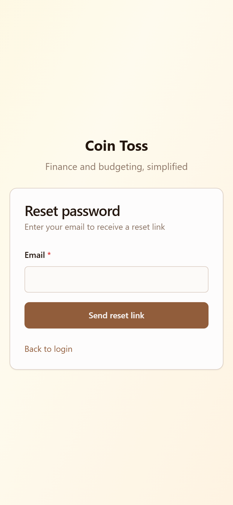

```
┌──────────────────────────────────────┐
│        ┌──────────────────┐          │
│        │    🪙 Coin Toss  │          │
│        │                  │          │
│        │  Reset Password  │          │
│        │                  │          │
│        │  ┌────────────┐  │          │
│        │  │   Email     │  │          │
│        │  └────────────┘  │          │
│        │                  │          │
│        │  [Send Link]     │          │
│        │                  │          │
│        │  ← Back to login │          │
│        └──────────────────┘          │
└──────────────────────────────────────┘
```

- Success state: green message "Check your email for a reset link"
- Error state: red error banner
- Never reveals whether email exists (security)

---

## 4. Reset Password Page (`/reset-password?token=xxx`)

**Desktop:** 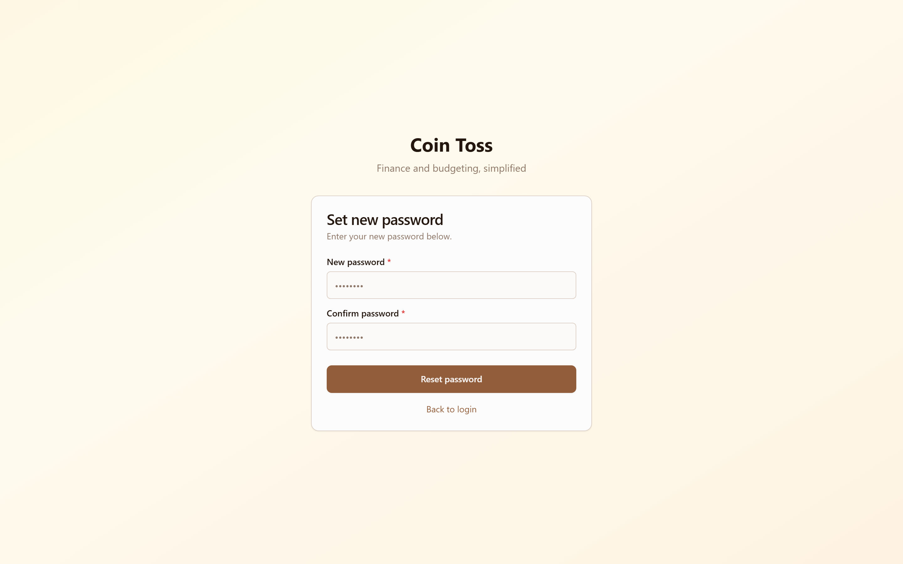 | **Mobile:** 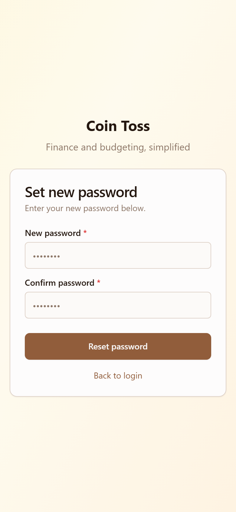

```
┌──────────────────────────────────────┐
│        ┌──────────────────┐          │
│        │    🪙 Coin Toss  │          │
│        │                  │          │
│        │  New Password *  │          │
│        │  ┌────────────┐  │          │
│        │  │ Password    │  │          │
│        │  └────────────┘  │          │
│        │  ┌────────────┐  │          │
│        │  │ Confirm     │  │          │
│        │  └────────────┘  │          │
│        │                  │          │
│        │  [Reset Password]│          │
│        │                  │          │
│        └──────────────────┘          │
└──────────────────────────────────────┘
```

- Invalid/expired token state: "Invalid or expired link" with link to /forgot-password
- Success state: "Password reset successfully" with link to /login

---

## 5. Dashboard (`/dashboard`)

**Desktop:** 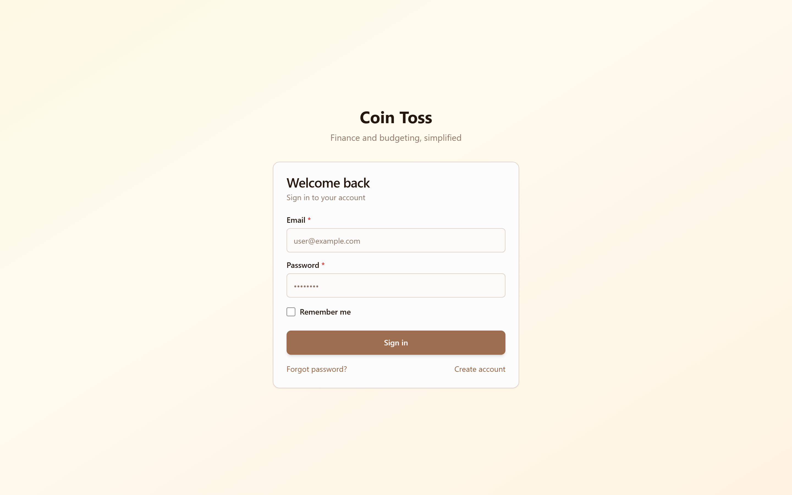 | **Mobile:** 

```
┌──────────────────────────────────────────────────────┐
│  Dashboard                                    [Header]│
├──────────────────────────────────────────────────────┤
│                                                      │
│  ┌──────────┐ ┌──────────┐ ┌──────────┐ ┌─────────┐ │
│  │ Balance  │ │ Income   │ │ Expenses │ │ Savings  │ │
│  │ $12,450  │ │ $5,230   │ │ $3,180   │ │ $2,050   │ │
│  └──────────┘ └──────────┘ └──────────┘ └─────────┘ │
│                                                      │
│  Health Score: 72/100 (Good)                        │
│                                                      │
│  ┌──────────────────────┐ ┌──────────────────────┐   │
│  │  Monthly Income vs    │ │  Income vs Expenses  │   │
│  │  Expenses (Bar Chart) │ │  Breakdown (Donut)  │   │
│  │                       │ │                      │   │
│  │  ▓▓░▓▓░▓▓░▓▓░▓▓░▓▓ │ │     ◉ 45% / 55%     │   │
│  └──────────────────────┘ └──────────────────────┘   │
│                                                      │
│  ┌───────────────────────────────────────────────┐  │
│  │  Budget Usage: 68% of $3,000 ████████░░░░░    │  │
│  └───────────────────────────────────────────────┘  │
│                                                      │
│  ┌─ Recent Transactions ────────────────────────┐   │
│  │  Grocery Store     -₪85.00     Jun 15       │   │
│  │  Salary            +₪12,000     Jun 01       │   │
│  │  Electric Bill     -₪320.00     Jun 03       │   │
│  └───────────────────────────────────────────────┘   │
│                                                      │
│  [Loading ↻]  [Error — Try Again]                  │
└──────────────────────────────────────────────────────┘
```

- 4 KPI cards with icons (Wallet, TrendingUp, TrendingDown, PiggyBank)
- Health score badge: ≥60 = green/success, <60 = yellow/warning
- Bar chart: monthly income vs expenses (6 months)
- Donut chart: income vs expense breakdown
- Budget progress bar with percentage
- Recent transactions (last 5)
- Loading skeleton and error+retry states

---

## 6. Transactions Page (`/transactions`)

**Desktop:** 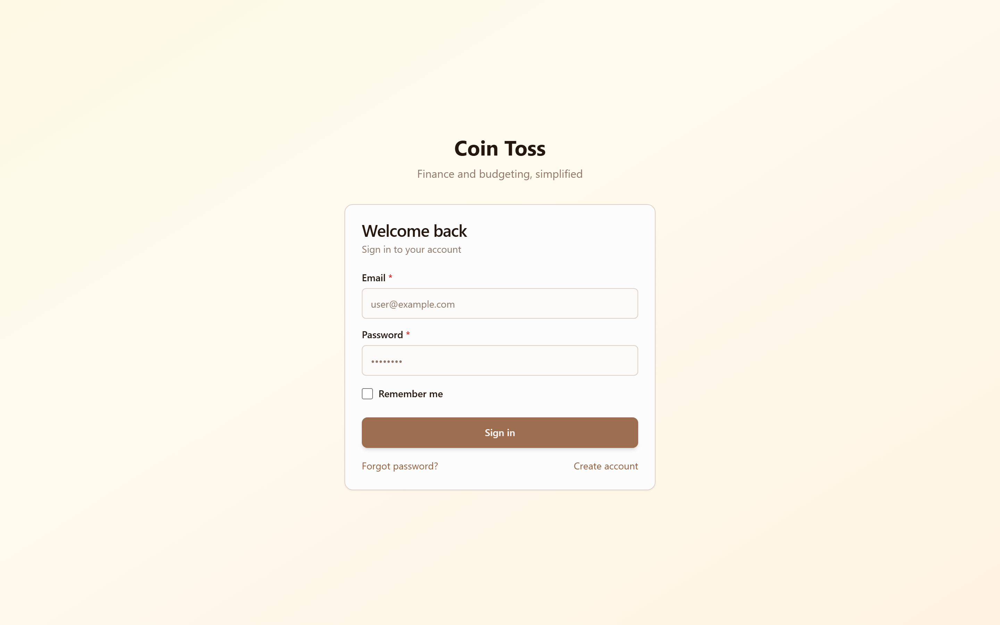 | **Mobile:** 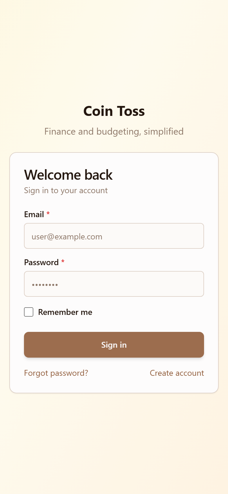

```
┌──────────────────────────────────────────────────────┐
│  Transactions           [+ Add Transaction]          │
├──────────────────────────────────────────────────────┤
│  ┌────────────┐  ┌─────────────┐                     │
│  │ 🔍 Search  │  │ Type ▼ All  │                     │
│  └────────────┘  └─────────────┘                     │
│                                                      │
│  ┌─────────────────────────────────────────────────┐│
│  │  Desc          │ Category │ Date    │ Type  │ Amt ││
│  │─────────────────────────────────────────────────││
│  │  Grocery Store │ Food 🟢 │ Jun 15  │ EXP   │-85 ││
│  │  Salary        │ Work 🔵 │ Jun 01  │ INC   │+12k││
│  │  📎 Electric   │ Util 🟡 │ Jun 03  │ EXP   │-320││
│  └─────────────────────────────────────────────────┘│
│                                                      │
│  ← Page 1 of 5 →                                    │
│                                                      │
│  [Mobile: Card layout instead of table]            │
└──────────────────────────────────────────────────────┘
```

- Search bar + type filter (All/Income/Expense/Transfer)
- Paginated table (15 per page), responsive card layout on mobile
- 📎 Paperclip icon for transactions with receipts
- Add/Edit/Delete with confirmation dialogs
- Lazy-loaded TransactionFormDialog
- Loading skeleton + error with retry

---

## 7. Budgets Page (`/budgets`)

**Desktop:**  | **Mobile:** 

```
┌──────────────────────────────────────────────────────┐
│  Budgets                      [+ Add Budget]        │
├──────────────────────────────────────────────────────┤
│                                                      │
│  ┌──────────────────┐  ┌──────────────────┐         │
│  │  🍔 Food         │  │  🏠 Rent         │         │
│  │  Monthly         │  │  Monthly         │         │
│  │                  │  │                  │         │
│  │  $450 / $600     │  │  $1,200 / $1,200│         │
│  │  ████████░░ 75%  │  │  ██████████ 100% │         │
│  │       (warning)  │  │     (destructive)│         │
│  │  [Edit] [Delete] │  │  [Edit] [Delete] │         │
│  └──────────────────┘  └──────────────────┘         │
│                                                      │
│  Budget card colors:                                 │
│  < 90% = default (primary)                          │
│  90-99% = warning (yellow)                           │
│  ≥ 100% = destructive (red)                          │
│                                                      │
│  [Empty state: "No budgets yet. Create one!"]       │
└──────────────────────────────────────────────────────┘
```

- 2-column grid on md+, single column on mobile
- Progress bar with color-coded thresholds
- Category color dot + name
- Lazy-loaded BudgetFormDialog with shadcn Select for category and period

---

## 8. Goals Page (`/goals`)

**Desktop:**  | **Mobile:** 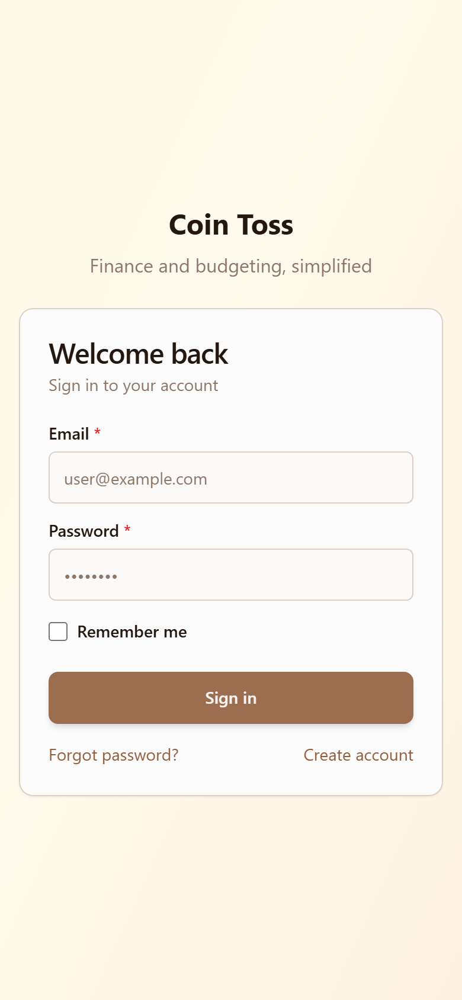

```
┌──────────────────────────────────────────────────────┐
│  Savings Goals                  [+ Add Goal]        │
├──────────────────────────────────────────────────────┤
│                                                      │
│  ┌──────────────────┐  ┌──────────────────┐         │
│  │  🎯 Vacation      │  │  🎯 Emergency     │         │
│  │  $1,200 / $3,000  │  │  $800 / $5,000   │         │
│  │  ██████░░░░ 40%   │  │  ███░░░░░░ 16%   │         │
│  │  Deadline: Sep 15 │  │                    │         │
│  │  [Contribute]     │  │  [Contribute]     │         │
│  │  [Edit] [Delete]  │  │  [Edit] [Delete]  │         │
│  └──────────────────┘  └──────────────────┘         │
│                                                      │
└──────────────────────────────────────────────────────┘
```

- 2-column grid on md+
- Progress percentage and bar
- Optional deadline display
- Contribute button opens ContributeFormDialog (lazy-loaded)
- Delete confirmation dialog

---

## 9. Analytics Page (`/analytics`)

**Desktop:**  | **Mobile:** 

```
┌──────────────────────────────────────────────────────┐
│  Financial Analytics                                 │
├──────────────────────────────────────────────────────┤
│                                                      │
│  ┌──────────┐ ┌──────────┐ ┌──────────┐ ┌─────────┐│
│  │Avg Spend  │ │Savings%  │ │Health     │ │Net Worth││
│  │$2,180/mo  │ │18%       │ │72/100     │ │$12,450  ││
│  └──────────┘ └──────────┘ └──────────┘ └─────────┘│
│                                                      │
│  ┌──────────────────────────────────────────────┐    │
│  │  Monthly Spending Trend (Area Chart)          │    │
│  │  Income line + Expense filled area, 6 months  │    │
│  └──────────────────────────────────────────────┘    │
│                                                      │
│  ┌────────────────────┐ ┌────────────────────────┐   │
│  │ Category Breakdown │ │  Cash Flow (Bar Chart) │   │
│  │    (Donut)         │ │  12-month bars         │   │
│  │   🍔 28%           │ │  Income ⬜ Expense ⬛   │   │
│  │   🏠 22%           │ │                        │   │
│  │   🚗 15%           │ │                        │   │
│  └────────────────────┘ └────────────────────────┘   │
│                                                      │
│  [Error state: "Something went wrong" — Try Again]  │
└──────────────────────────────────────────────────────┘
```

- 4 KPI cards (avg spending, savings rate, health score, net worth)
- Area chart: monthly spending trend with income line
- Donut: category breakdown with color legend
- Bar chart: cash flow (12 months)
- All queries have error+retry states

---

## 10. Notifications Page (`/notifications`)

**Desktop:** 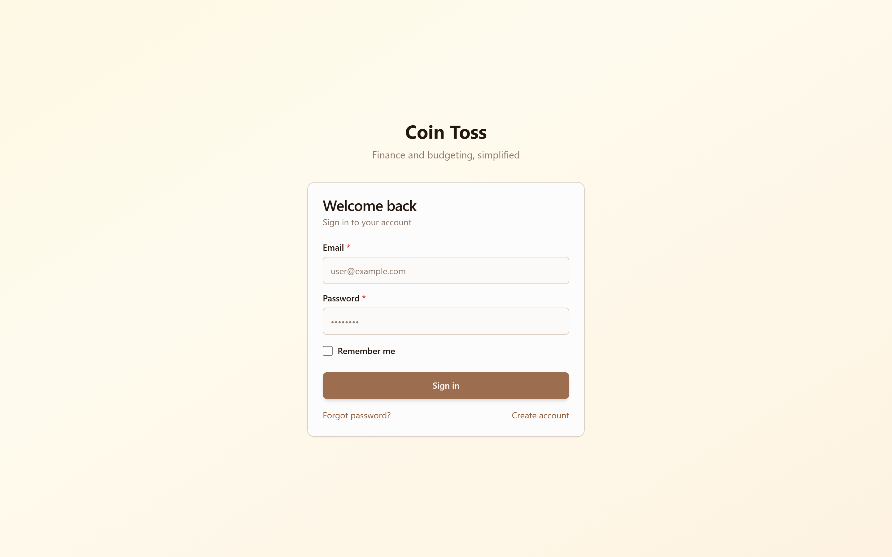 | **Mobile:** 

```
┌──────────────────────────────────────────────────────┐
│  Notifications (3)                    [Mark all read]│
├──────────────────────────────────────────────────────┤
│                                                      │
│  ┌──────────────────────────────────────────────┐    │
│  │  🔔 Budget Warning          🔴 unread       │    │
│  │  "Food budget reached 90%"                  │    │
│  │  Jun 15, 2026                    [🗑 Delete] │    │
│  ├──────────────────────────────────────────────┤    │
│  │  🔔 Goal Reached            (read)          │    │
│  │  "Vacation goal is 100% complete!"          │    │
│  │  Jun 14, 2026                    [🗑 Delete] │    │
│  └──────────────────────────────────────────────┘    │
│                                                      │
│  [Empty state: "No notifications"]                  │
└──────────────────────────────────────────────────────┘
```

- Unread count in title as badge
- Unread items highlighted with bg-muted/50
- Mark all read button with loading spinner
- Individual delete with confirmation dialog

---

## 11. Settings Page (`/settings`)

**Desktop:** 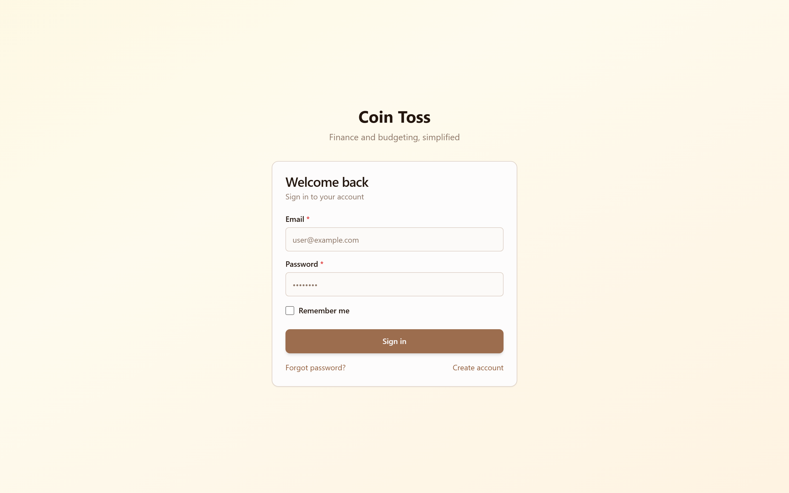 | **Mobile:** 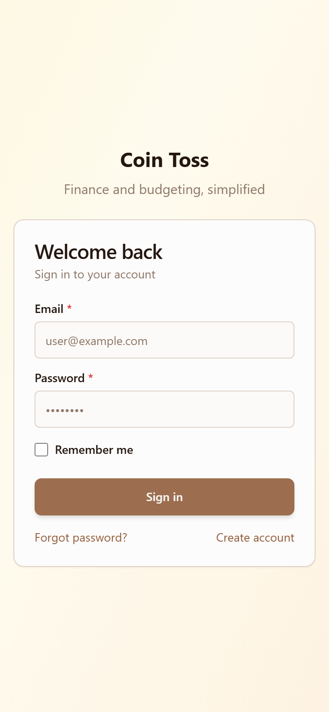

```
┌──────────────────────────────────────────────────────┐
│  Settings                                            │
├──────────────────────────────────────────────────────┤
│                                                      │
│  ┌─ Profile ────────────────────────────────────┐   │
│  │  Name:  Jane Doe                    [Edit]    │   │
│  │  Email: jane@example.com                     │   │
│  └───────────────────────────────────────────────┘   │
│                                                      │
│  ┌─ Password ───────────────────────────────────┐    │
│  │                              [Change Password]│    │
│  └───────────────────────────────────────────────┘   │
│                                                      │
│  ┌─ Appearance ────────────────────────────────┐     │
│  │  🌙 Dark mode                    [Toggle]  │     │
│  └───────────────────────────────────────────────┘   │
│                                                      │
│  ┌─ Currency & Locale ─────────────────────────┐     │
│  │  Currency: [USD ▼]  (7 options)            │     │
│  │  Auto-saves on change                       │     │
│  └───────────────────────────────────────────────┘   │
│                                                      │
│  ┌─ Session ───────────────────────────────────┐     │
│  │  [Sign Out]                                 │     │
│  └───────────────────────────────────────────────┘   │
│                                                      │
│  ┌─ Danger Zone ───────────────────────────────┐     │
│  │  [Delete Account]  Type "DELETE" to confirm │     │
│  └───────────────────────────────────────────────┘   │
│                                                      │
└──────────────────────────────────────────────────────┘
```

- 6 card sections: Profile, Password, Appearance, Currency, Session, Danger Zone
- Edit Profile / Change Password open dialog forms with Zod validation
- Currency dropdown: USD, EUR, GBP, JPY, CNY, INR, ILS
- Delete Account requires typing "DELETE" to confirm
- All mutations show loading spinners and error states

---

## 12. Loading Page (`/loading`)

```
┌──────────────────────────────────────────────────────┐
│                                                      │
│                    background gradient                │
│                                                      │
│                  🪙 Coin Toss                        │
│                                                      │
│              Welcome back, Jane!                     │
│                                                      │
│               [MorphLoading animation]               │
│                                                      │
└──────────────────────────────────────────────────────┘
```

- Morph-loading animation (21st.dev component)
- Shows user name from auth store
- 800ms delay, then navigates to /dashboard
- If not authenticated, redirects to /login

---

## Shared Dialog Patterns

All CRUD dialogs follow the same pattern:

```
┌─ [Title] ──────────────────────── [✕] ─┐
│                                         │
│  Field Label *                          │
│  ┌──────────────────────────────────┐   │
│  │  Input value                     │   │
│  └──────────────────────────────────┘   │
│                                         │
│  [Cancel]                    [Save]     │
│                                         │
└─────────────────────────────────────────┘
```

- Red `*` on required fields
- Loading spinner on Save button during submission
- Error messages below invalid fields
- Responsive: 1-column on mobile, 2-column on md+ grid
- shadcn/ui Dialog component