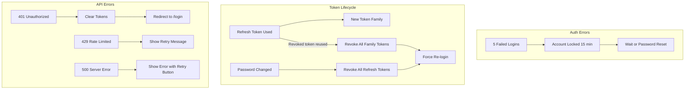
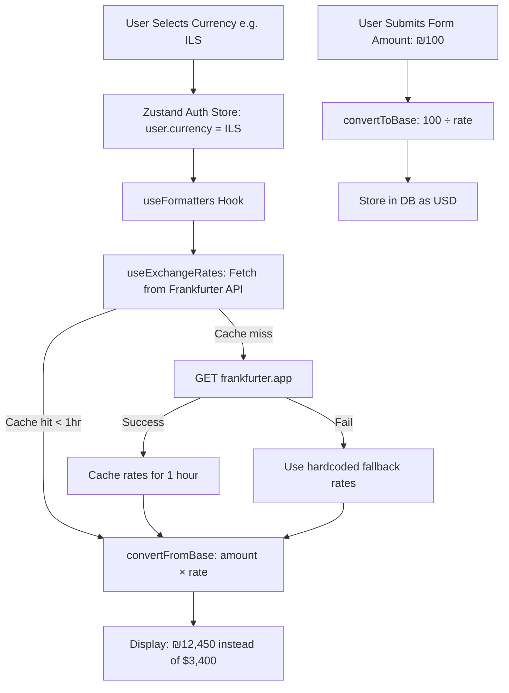

# D. User Flow

## Primary User Journey

```mermaid
flowchart TD
    A[User Opens App] --> B{Has Access Token?}
    B -->|No| C[/login]
    B -->|Yes| D[/loading]
    D --> E{Token Valid?}
    E -->|Yes| F[/dashboard]
    E -->|No| G{Has Refresh Token?}
    G -->|Yes| H[Refresh Token]
    H -->|Success| F
    H -->|Fail| C
    G -->|No| C

    C --> I[Enter Email + Password]
    I --> J{Valid Credentials?}
    J -->|Yes| K[Store Tokens]
    K --> F
    J -->|No| L[Show Error]
    L --> C

    C --> M[Forgot Password?]
    M --> N[/forgot-password]
    N --> O[Enter Email]
    O --> P[Send Reset Link]
    P --> Q[/reset-password?token=xxx]
    Q --> R[Enter New Password]
    R --> C

    C --> S[Create Account]
    S --> T[/register]
    T --> U[Enter Name + Email + Password]
    U --> V{Valid?}
    V -->|Yes| W[Account Created]
    W --> C
    V -->|No| X[Show Validation Errors]
    X --> T
```

## Authenticated Navigation

```mermaid
flowchart LR
    DASH[/dashboard] --> TXN[/transactions]
    DASH --> BUD[/budgets]
    DASH --> GOAL[/goals]
    DASH --> ANAL[/analytics]
    DASH --> NOTIF[/notifications]
    DASH --> SET[/settings]

    TXN --> TXN_ADD[Add Transaction]
    TXN --> TXN_EDIT[Edit Transaction]
    TXN --> TXN_DEL[Delete Transaction]
    TXN --> TXN_BULK[Bulk Delete]
    TXN --> TXN_UPLOAD[Upload Receipt]

    BUD --> BUD_ADD[Add Budget]
    BUD --> BUD_EDIT[Edit Budget]
    BUD --> BUD_DEL[Delete Budget]

    GOAL --> GOAL_ADD[Add Goal]
    GOAL --> GOAL_EDIT[Edit Goal]
    GOAL --> GOAL_DEL[Delete Goal]
    GOAL --> GOAL_CONTR[Contribute to Goal]

    SET --> SET_PROFILE[Edit Profile]
    SET --> SET_PASS[Change Password]
    SET --> SET_CURRENCY[Change Currency/Locale]
    SET --> SET_THEME[Toggle Dark Mode]
    SET --> SET_LOGOUT[Sign Out]
    SET --> SET_DELETE[Delete Account]
```

## Error & Edge-Case Flows



## Category Deletion Flow

```mermaid
flowchart TD
    DEL_CAT[User Deletes Category] --> FIND_OTHER{Other category of same type?}
    FIND_OTHER -->|Yes| USE_OTHER[Reassign transactions & budgets to other category]
    FIND_OTHER -->|No| CREATE_UNCATEG[Create "Uncategorized" fallback category]
    CREATE_UNCATEG --> USE_OTHER
    USE_OTHER --> DELETE_CAT[Delete the category]
    DELETE_CAT --> DONE[Done — No orphaned data]

    style CREATE_UNCATEG fill:#f0ad4e
    style DELETE_CAT fill:#d9534f
    style DONE fill:#5cb85c
```

## Recurring Transaction Processing Flow (Daily Cron)

```mermaid
flowchart TD
    CRON[Vercel Cron: Daily at Midnight] --> AUTH{Valid CRON_SECRET?}
    AUTH -->|No| REJECT[401 Unauthorized]
    AUTH -->|Yes| FIND[Find all active recurring transactions where nextDate <= now]
    FIND --> |None found| EMPTY[Return { processed: 0 }]
    FIND --> |Found N records| CREATE[Create N Transaction records from templates]
    CREATE --> UPDATE[Update nextDate on each RecurringTransaction]
    UPDATE --> |nextDate > endDate| DEACTIVATE[Set isActive = false]
    UPDATE --> |nextDate <= endDate| KEEP_ACTIVE[Keep isActive = true]
    DEACTIVATE --> RESULT[Return { processed: N }]
    KEEP_ACTIVE --> RESULT
```

## Currency Conversion Flow



## Page-by-Page User Flow Summary

| Page | Primary Action | Success Outcome | Error Outcome |
|------|---------------|----------------|---------------|
| /login | Submit email + password | Redirect to /dashboard | Show error banner |
| /register | Submit name + email + password | Redirect to /login | Show validation errors |
| /forgot-password | Submit email | Show "Check your email" | Show error |
| /reset-password | Submit new password | Show "Password reset" + link to /login | Show "Invalid link" |
| /loading | Auto-authenticate via stored token | Redirect to /dashboard | Redirect to /login |
| /dashboard | View summary | See KPIs, charts, recent transactions | Error state with retry |
| /transactions | CRUD transactions | List with pagination and filters | Error state with retry |
| /budgets | CRUD budgets | Cards with progress bars | Error state with retry |
| /goals | CRUD goals + contribute | Cards with progress | Error state with retry |
| /analytics | View charts and KPIs | Interactive charts | Error state with retry |
| /notifications | Mark read / delete | Updated notification list | Error state with retry |
| /settings | Edit profile, password, currency, theme | Confirmation toast | Show field errors |